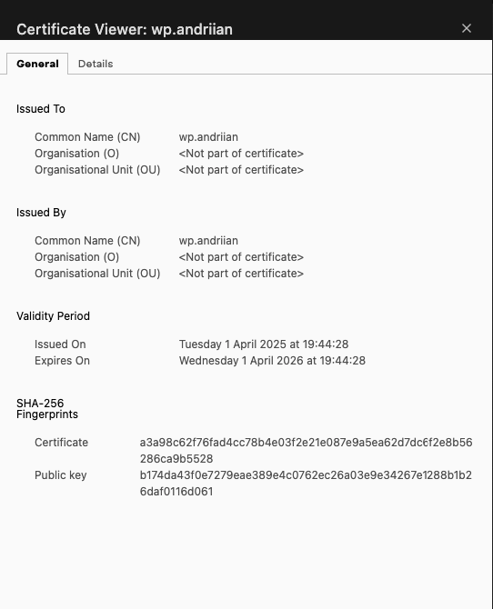
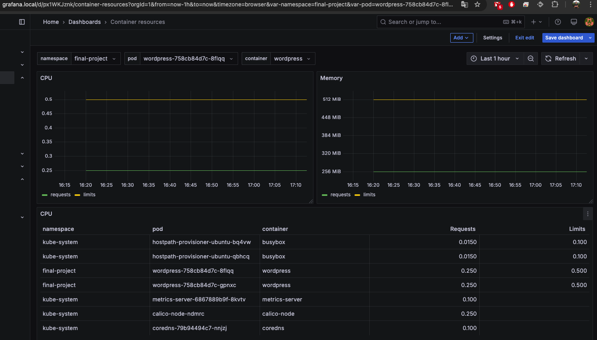
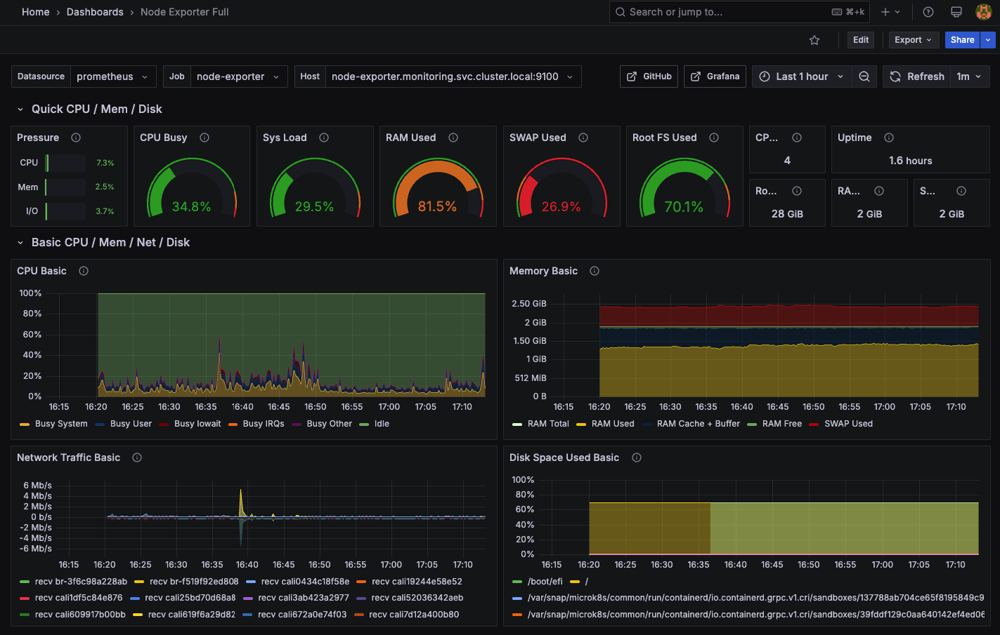
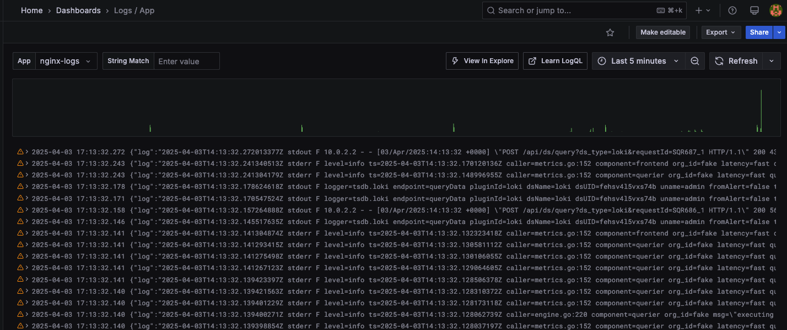
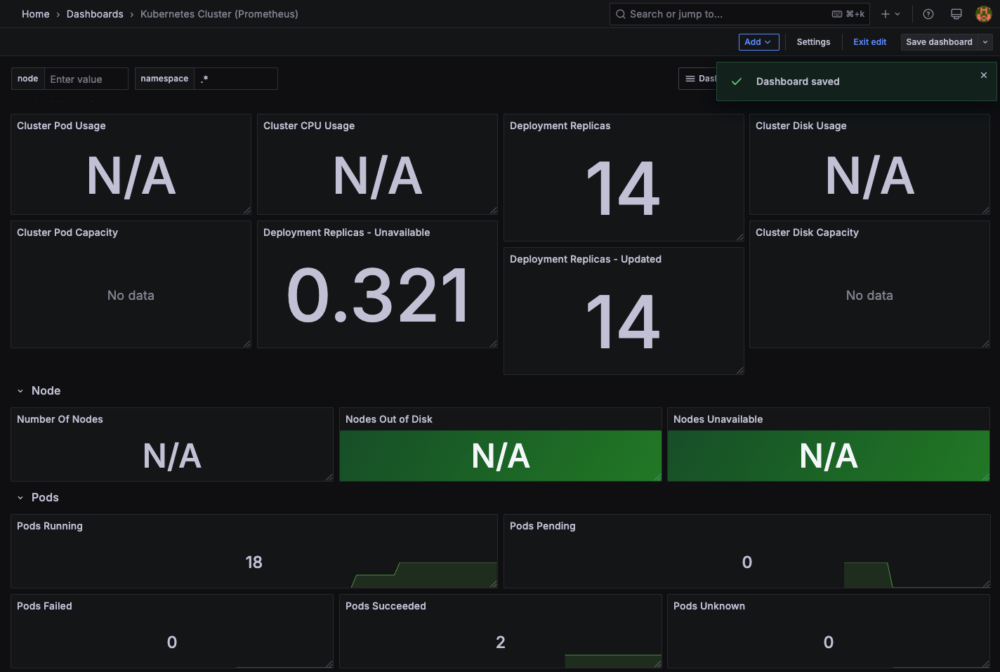
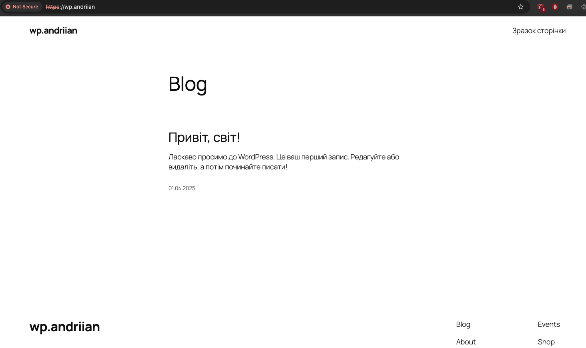

# Final Project Deployment Guide

## Структура проєкту

```bash
.
├── cert-manager
│   ├── certificate.yaml
│   └── issuer.yaml
├── monitoring
│   ├── fluent
│   │   ├── fluent-bit-config.yaml
│   │   └── fluent-bit-deamonset.yaml
│   ├── grafana
│   │   ├── grafana-deployment.yaml
│   │   ├── grafana-ingress.yaml
│   │   └── grafana-service.yaml
│   ├── kube-state-metrics.yaml
│   ├── loki
│   │   ├── loki-config.yaml
│   │   ├── loki-deployment.yaml
│   │   ├── loki-pv.yaml
│   │   ├── loki-pvc.yaml
│   │   └── loki-service.yaml
│   ├── namespace.yaml
│   ├── node-exporter.yaml
│   ├── prometheus-config.yaml
│   ├── prometheus-deployment.yaml
│   └── prometheus-service.yaml
├── mysql
│   ├── mysql-cfg.yaml
│   ├── mysql-deployment.yaml
│   ├── mysql-pvc.yaml
│   ├── mysql-secret-user.yaml
│   ├── mysql-secret.yaml
│   └── mysql-service.yaml
├── namespace.yaml
├── wordpress
│   ├── wp-deployment.yaml
│   ├── wp-hpa.yaml
│   ├── wp-ingress.yaml
│   ├── wp-pvc.yaml
│   └── wp-service.yaml
└── wp.andriian
    ├── Chart.yaml
    ├── charts
    ├── templates
    │   ├── deployment.yaml
    │   ├── hpa.yaml
    │   ├── ingress.yaml
    │   ├── pvc.yaml
    │   └── service.yaml
    └── values.yaml
```

## Створення проєкту

```bash
mkdir Final-Project
cd Final-Project
```

## Створення простору імен

```bash
microk8s.kubectl apply -f namespace.yaml
```

## Встановлення Cert-Manager

```bash
cd cert-manager/
microk8s.kubectl apply -f issuer.yaml
microk8s.kubectl apply -f certificate.yaml
microk8s.kubectl get all -n final-project
```

## Встановлення MySQL

```bash
cd ../mysql/
microk8s.kubectl apply -f mysql-secret.yaml
microk8s.kubectl apply -f mysql-pvc.yaml
microk8s.kubectl apply -f mysql-cfg.yaml
microk8s.kubectl apply -f mysql-deployment.yaml
microk8s.kubectl get all -n final-project
microk8s.kubectl apply -f mysql-service.yaml
```

## Встановлення WordPress

```bash
cd ../wordpress/
microk8s.kubectl apply -f wp-pvc.yaml
microk8s.kubectl apply -f wp-deployment.yaml
microk8s.kubectl apply -f wp-service.yaml
microk8s.kubectl apply -f wp-ingress.yaml
microk8s.kubectl apply -f wp-hpa.yaml
microk8s.kubectl get all -n final-project
```

### Вивід ресурсів:

<details>
<summary>Поточний стан кластеру</summary>

```bash
NAME                             READY   STATUS    RESTARTS   AGE
pod/mysql-68bfcbfd95-bk4ts       1/1     Running   1          44h
pod/wordpress-758cb84d7c-8flqq   1/1     Running   1          44h
pod/wordpress-758cb84d7c-gpnxc   1/1     Running   1          44h

NAME                TYPE        CLUSTER-IP       EXTERNAL-IP   PORT(S)    AGE
service/mysql       ClusterIP   10.152.183.103   <none>        3306/TCP   44h
service/wordpress   ClusterIP   10.152.183.137   <none>        80/TCP     44h

NAME                        READY   UP-TO-DATE   AVAILABLE   AGE
deployment.apps/mysql       1/1     1            1           44h
deployment.apps/wordpress   2/2     2            2           44h

NAME                                   DESIRED   CURRENT   READY   AGE
replicaset.apps/mysql-68bfcbfd95       1         1         1       44h
replicaset.apps/wordpress-758cb84d7c   2         2         2       44h

NAME                                                REFERENCE              TARGETS       MINPODS   MAXPODS   REPLICAS   AGE
horizontalpodautoscaler.autoscaling/wordpress-hpa   Deployment/wordpress   cpu: 0%/50%   2         4         2          44h
```

```bash
microk8s.kubectl get hpa -n final-project
NAME            REFERENCE              TARGETS        MINPODS   MAXPODS   REPLICAS   AGE
wordpress-hpa   Deployment/wordpress   cpu: 0%/50%   2         4         2          44h
```
</details>

## Навантаження на кластер (Siege)

```bash
siege -c 20 -t 30s https://wp.andriian
```

<details>
<summary>Стан після навантаження</summary>

```bash
microk8s.kubectl get hpa -n final-project
NAME            REFERENCE              TARGETS         MINPODS   MAXPODS   REPLICAS   AGE
wordpress-hpa   Deployment/wordpress   cpu: 190%/50%   2         4         2          44h
```

```bash
microk8s.kubectl get pods -n final-project
NAME                         READY   STATUS    RESTARTS   AGE
mysql-68bfcbfd95-bk4ts       1/1     Running   1          44h
wordpress-758cb84d7c-8flqq   1/1     Running   1          44h
wordpress-758cb84d7c-9wt82   1/1     Running   0          11s
wordpress-758cb84d7c-gpnxc   1/1     Running   1          44h
wordpress-758cb84d7c-wj8dr   1/1     Running   0          11s
```
</details>

## Моніторинг (Prometheus, Grafana, Loki, Fluent Bit)

```bash
cd ../monitoring/
microk8s.kubectl apply -f namespace.yaml
microk8s.kubectl apply -f prometheus-config.yaml
microk8s.kubectl apply -f prometheus-deployment.yaml
microk8s.kubectl apply -f prometheus-service.yaml

microk8s.kubectl apply -f loki/loki-config.yaml
microk8s.kubectl apply -f loki/loki-pv.yaml
microk8s.kubectl apply -f loki/loki-pvc.yaml
microk8s.kubectl apply -f loki/loki-deployment.yaml
microk8s.kubectl apply -f loki/loki-service.yaml

microk8s.kubectl apply -f fluent/fluent-bit-config.yaml
microk8s.kubectl apply -f fluent/fluent-bit-deamonset.yaml

microk8s.kubectl apply -f grafana/grafana-deployment.yaml
microk8s.kubectl apply -f grafana/grafana-service.yaml
microk8s.kubectl apply -f grafana/grafana-ingress.yaml

microk8s.kubectl apply -f kube-state-metrics.yaml
microk8s.kubectl apply -f node-exporter.yaml

microk8s.kubectl get all -n monitoring
```

<details>

```bash
NAME                           READY   STATUS    RESTARTS   AGE
NAME                                      READY   STATUS    RESTARTS   AGE
pod/fluent-bit-447dh                      1/1     Running   0          48m
pod/grafana-85b785d45d-kj549              1/1     Running   0          48m
pod/kube-state-metrics-669cccd79c-l872w   1/1     Running   0          48m
pod/loki-54d84d4bbb-lr6td                 1/1     Running   0          42m
pod/node-exporter-5chrv                   1/1     Running   0          47m
pod/prometheus-58cd678dfc-5wzwt           1/1     Running   0          51m

NAME                         TYPE        CLUSTER-IP       EXTERNAL-IP   PORT(S)          AGE
service/grafana              ClusterIP   10.152.183.84    <none>        3000/TCP         48m
service/kube-state-metrics   ClusterIP   10.152.183.117   <none>        8080/TCP         48m
service/loki                 ClusterIP   10.152.183.120   <none>        3100/TCP         48m
service/node-exporter        ClusterIP   10.152.183.221   <none>        9100/TCP         47m
service/prometheus-service   NodePort    10.152.183.76    <none>        9090:30152/TCP   51m

NAME                           DESIRED   CURRENT   READY   UP-TO-DATE   AVAILABLE   NODE SELECTOR   AGE
daemonset.apps/fluent-bit      1         1         1       1            1           <none>          48m
daemonset.apps/node-exporter   1         1         1       1            1           <none>          47m

NAME                                 READY   UP-TO-DATE   AVAILABLE   AGE
deployment.apps/grafana              1/1     1            1           48m
deployment.apps/kube-state-metrics   1/1     1            1           48m
deployment.apps/loki                 1/1     1            1           48m
deployment.apps/prometheus           1/1     1            1           51m

NAME                                            DESIRED   CURRENT   READY   AGE
replicaset.apps/grafana-85b785d45d              1         1         1       48m
replicaset.apps/kube-state-metrics-669cccd79c   1         1         1       48m
replicaset.apps/loki-54d84d4bbb                 1         1         1       48m
replicaset.apps/prometheus-58cd678dfc           1         1         1       51m
```
</details>

## Видалення простору імен

```bash
microk8s.kubectl delete namespace final-project
```

## Встановлення Helm-чарту WordPress

```bash
helm dependency update wp.andriian/
sudo microk8s.kubectl config view --raw > ~/.kube/config
helm install wp ./wp.andriian/ --kubeconfig ~/.kube/config -n wordpress --create-namespace
```

### Вивід:

```bash
NAME: wp
NAMESPACE: wordpress
STATUS: deployed
REVISION: 1
```

```bash
NAME                                READY   STATUS    RESTARTS   AGE
pod/wp-mysql-0                      1/1     Running   0          4m22s
pod/wp-wordpress-757f77db87-b2dtr   1/1     Running   0          4m22s

NAME                        TYPE        CLUSTER-IP       EXTERNAL-IP   PORT(S)    AGE
service/wp-mysql            ClusterIP   10.152.183.183   <none>        3306/TCP   4m24s
service/wp-mysql-headless   ClusterIP   None             <none>        3306/TCP   4m24s
service/wp-wordpress        ClusterIP   10.152.183.28    <none>        80/TCP     4m24s

NAME                           READY   UP-TO-DATE   AVAILABLE   AGE
deployment.apps/wp-wordpress   1/1     1            1           4m24s

NAME                                      DESIRED   CURRENT   READY   AGE
replicaset.apps/wp-wordpress-757f77db87   1         1         1       4m23s

NAME                        READY   AGE
statefulset.apps/wp-mysql   1/1     4m23s

NAME                                                   REFERENCE                 TARGETS       MINPODS   MAXPODS   REPLICAS   AGE
horizontalpodautoscaler.autoscaling/wp-wordpress-hpa   Deployment/wp-wordpress   cpu: 0%/50%   1         4         1          4m24s
```


## 🖼️ Скріншоти

### 📄 Certificate


### 📊 Графани Dashboard





### 📝 WordPress


---
